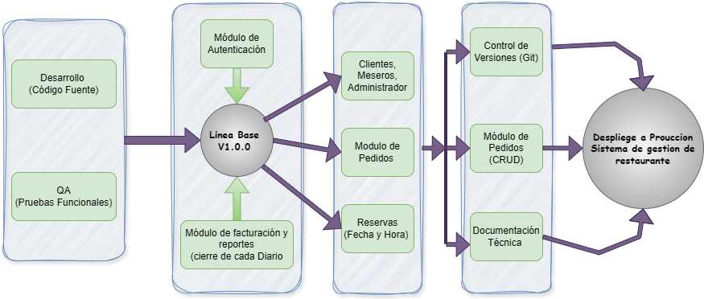

# sistemarestaurante
# Línea Base Sistema de Gestión de Restaurante

## Información del Estudiante

**Nombres y apellidos:**  
Juan David Álvarez Moreno  

## Asesor

**Nombre:**  
Helio Ruber Lopez Carreño  

**Área:**  
Gestión del Software  

## Institución Académica

**Universidad:**  
Universidad Tecnológica del Oriente  

**Programa:**  
Ingeniería de Software  

**Año:**  
2026  

---

## Introducción

El **Sistema de Gestión de Restaurante** es una solución integral diseñada para optimizar la cadena de valor operativa de un restaurante. Su arquitectura se apoya en un ciclo de vida de desarrollo moderno y automatizado que garantiza la entrega de software de alta calidad.

### Módulos de la Solución

1. **Gestión de Acceso (Autenticación):**  
   Control robusto de identidades para clientes, meseros y administradores, asegurando que cada actor interactúe solo con las funciones permitidas según su rol.

2. **Menú Digital Inteligente:**  
   Herramienta administrativa para el mantenimiento de platos y categorías, permitiendo actualizaciones en tiempo real de la oferta gastronómica.

3. **Pedidos:**  
   Flujo digitalizado desde la toma de pedido hasta la entrega, permitiendo el seguimiento del estado de la orden por parte de la cocina y el cliente.

4. **Sistema de Reservas:**  
   Motor de agendamiento que permite la selección de fecha y hora, optimizando la ocupación del establecimiento y evitando sobreventas.

5. **Cierre de Caja y Reportes:**  
   Consolidación de ventas diarias para facilitar el cierre financiero y proporcionar reportes analíticos para la toma de decisiones gerenciales.

---

## Justificación

Establecer una **Línea Base** en las etapas tempranas, como se observa en el nodo central de **Control de Versiones**, es fundamental por las siguientes razones técnicas:

1. **Garantía de Trazabilidad y Estabilidad:**  
   La línea base actúa como el punto central del sistema. Todo el código del desarrollador y los guiones del ensayador convergen en el control de versiones antes de pasar a las herramientas de Integración Continua (CI). Esto asegura que cualquier error detectado en producción pueda rastrearse hasta su origen exacto en el código fuente.

2. **Validación Rigurosa mediante Pruebas Automatizadas:**  
   Al definir una línea base estable, se pueden ejecutar las Pruebas de Aceptación Automática (AAT) y las Pruebas Exploratorias sobre una versión de software predecible. Sin una línea base, el equipo de QA (Ensayador) estaría probando un “blanco móvil”, lo que invalidaría los resultados de los informes técnicos.

3. **Control de Regresión y Despliegue Seguro:**  
   El flujo hacia Producción depende de pasar por pruebas de regresión de puesta en escena y reproducción. La línea base permite comparar la versión actual con la anterior, garantizando que las nuevas funcionalidades (como el módulo de facturación) no rompan los módulos ya existentes (como el de autenticación).

4. **Ciclo de Mantenimiento Eficiente:**  
   Una vez que el sistema está en Producción, cualquier mejora o corrección en la etapa de Mantenimiento debe regresar al control de versiones para actualizar la línea base. Esto evita la deriva de código y asegura que el sistema evolucione de forma ordenada y profesional.

---

**Sistema de Gestión de Restaurante**

